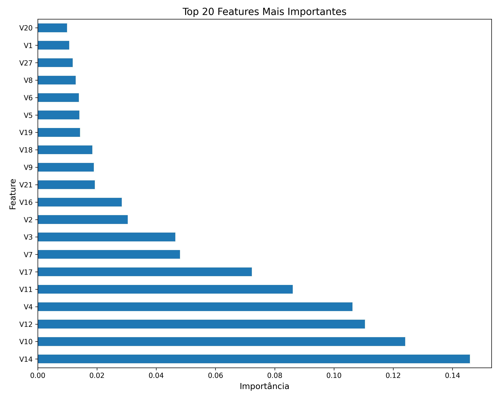
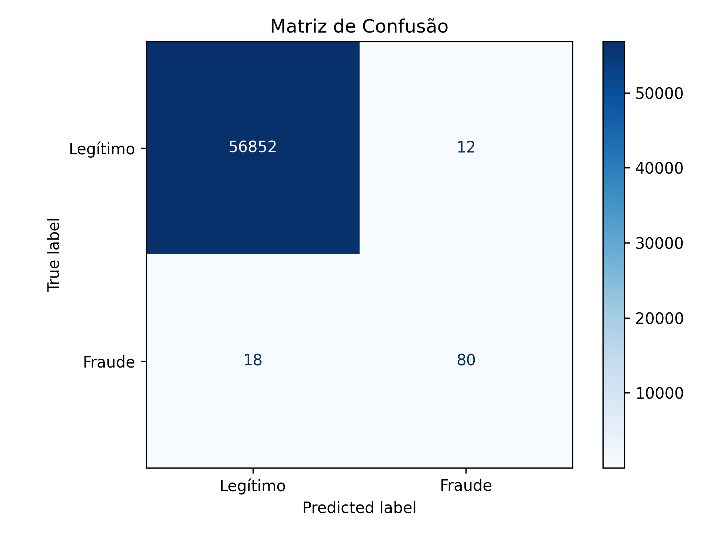
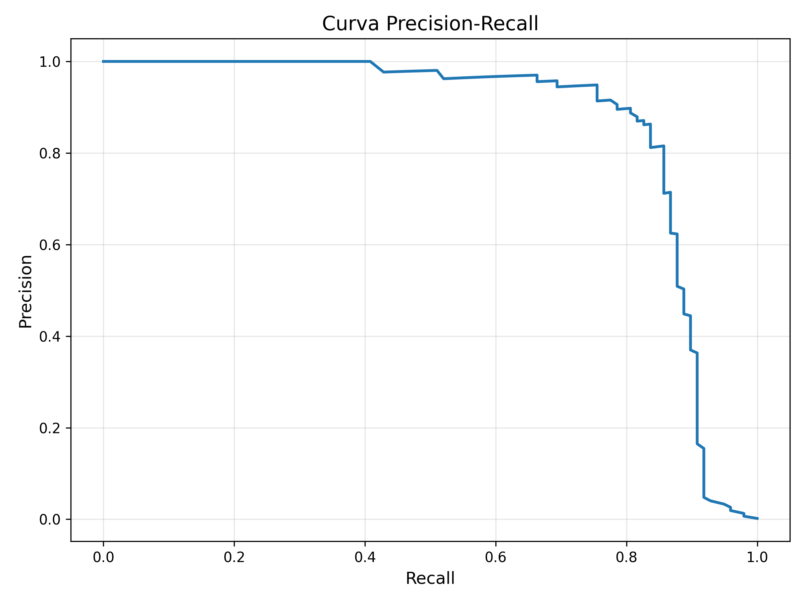
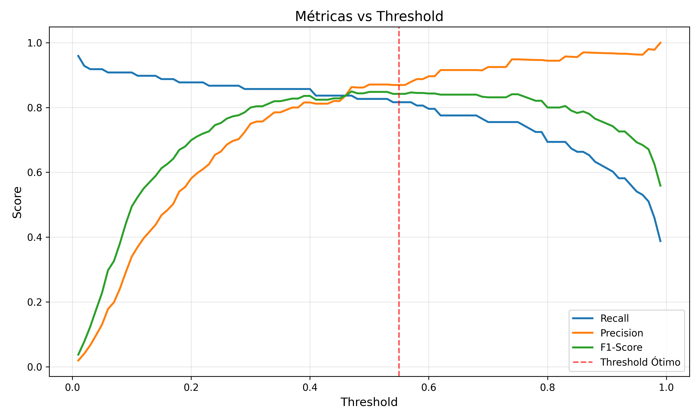
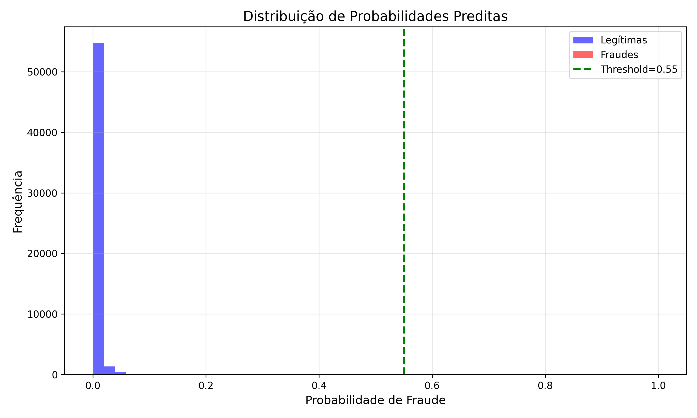

Detecção de Fraude em Cartões de Crédito
Sobre o Projeto
Este projeto utiliza técnicas de Machine Learning para identificar transações fraudulentas em cartões de crédito. O principal desafio abordado foi o desequilíbrio dos dados (apenas 0,17% de fraudes no dataset do Kaggle).

O diferencial desta solução é a otimização baseada no custo de negócio, priorizando a redução do prejuízo financeiro em vez de métricas puramente estatísticas.

1. Tecnologias e Técnicas
Linguagem: Python

Processamento de Dados: Pandas, NumPy

Machine Learning: Scikit-learn (Random Forest, Logistic Regression)

Tratamento de Dados Desbalanceados: SMOTE (Synthetic Minority Over-sampling Technique)

Pré-processamento: RobustScaler (para lidar com outliers)

Otimização: RandomizedSearchCV e Threshold Tuning

2. Resultados e Impacto de Negócio
O modelo foi ajustado para maximizar a captura de fraudes, minimizando o custo total para a instituição financeira.

Métrica	Resultado Alcançado
Recall (Sensibilidade)	90,81%
Precision	33,97%
F1-Score	0,49
Threshold Otimizado	0,10

3. Análise de Custo
Considerando um custo de R$ 2.500,00 por fraude perdida (Falso Negativo) e R$ 10,00 por cliente bloqueado indevidamente (Falso Positivo):

Custo Total Estimado: R$ 24.230,00

Fraudes Perdidas: Apenas 9 em um conjunto de teste de 56.962 transações.

Clientes Bloqueados: 173 (atrito operacional aceitável perante a economia gerada).

## Visualizações

O projeto inclui análises visuais detalhadas para interpretar o desempenho do modelo no contexto de detecção de fraude.

### 1. Feature Importance
Identifica as variáveis (decorrentes do PCA) que o modelo considerou mais críticas para a tomada de decisão. As componentes **V14, V10 e V12** foram os principais indicadores de comportamento fraudulento.

---

### 2. Matriz de Confusão
Visualização do desempenho do modelo no conjunto de teste (**threshold = 0.55**). Demonstra a eficácia em capturar fraudes mantendo um baixo índice de falsos positivos.

---

### 3. Curva Precision-Recall
Métrica essencial para dados altamente desbalanceados. A curva demonstra que o modelo mantém alta precisão mesmo quando o recall é elevado.

---

### 4. Métricas vs Threshold
Este gráfico justifica a escolha do threshold de decisão, mostrando onde o **F1-Score é maximizado** e o equilíbrio entre Precision e Recall.

---

### 5. Distribuição de Probabilidades Preditas
Demonstra como o modelo separa as classes. A concentração de transações legítimas próximas de zero indica alta confiança do modelo na classe majoritária.

5. Como Executar
Clone o repositório.

Instale as dependências: pip install -r requirements.txt.

Baixe o dataset creditcard.csv do Kaggle e coloque-o na pasta csvfile/.

Execute o script principal: python train_model.py.

👤 Autor
Lorenzo Nakayama Machado

Graduando em Ciência da Computação pela Pontifícia Universidade Católica do Paraná (PUCPR).

Interesse em IA, Ciência de Dados e Desenvolvimento Python.
